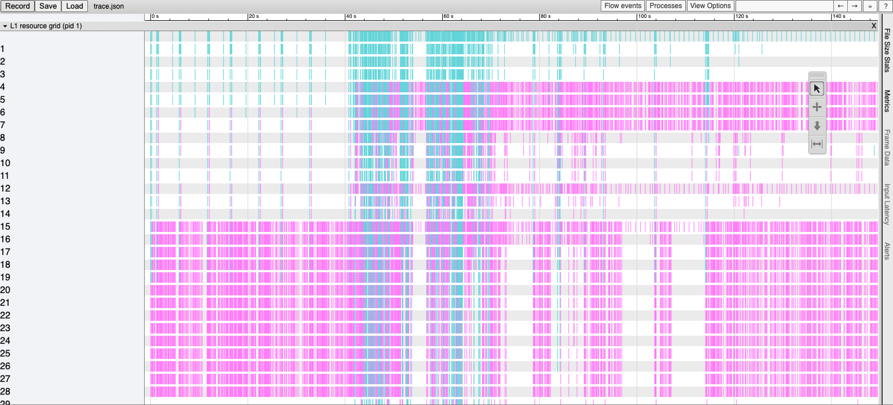

# Janus Data Processing

Process and visualize the data stream collected from Janus debugger 

# Prerequisite

Run `pip install -r requirement.txt`

# Usage

### Visualize data

Parsing L1/2 data using ParseLX.py script. For example:

```
python ParseL2.py --data_path <PATH_TO_DATA> --relative_time --verbose
```

This will give you list of time series and stats of the input L1 data (e.g. Byte sent per frame, MAC PDU intervals)

### Convert L1 data to tracing file

Convert L1 data to tracing file:

```
python ParseL1.py --data_path <PATH_TO_DATA> --save_trace
```

The trace file will be stored in `out` directory and can be viewed by Chrome tracing files. To view the trace, open chrome and type `chrome://tracing` and then load the trace file. You will see something similar to this:



Get the usage of this script: `python ParseLX.py -h`

